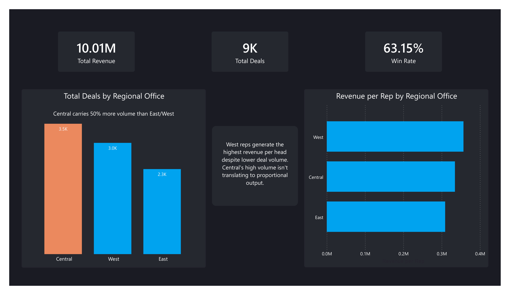
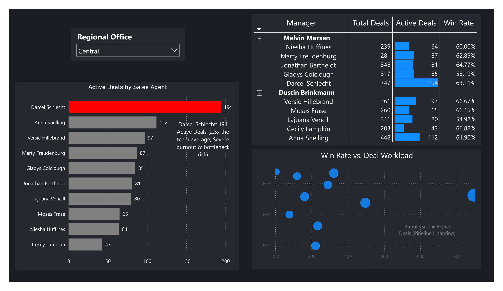
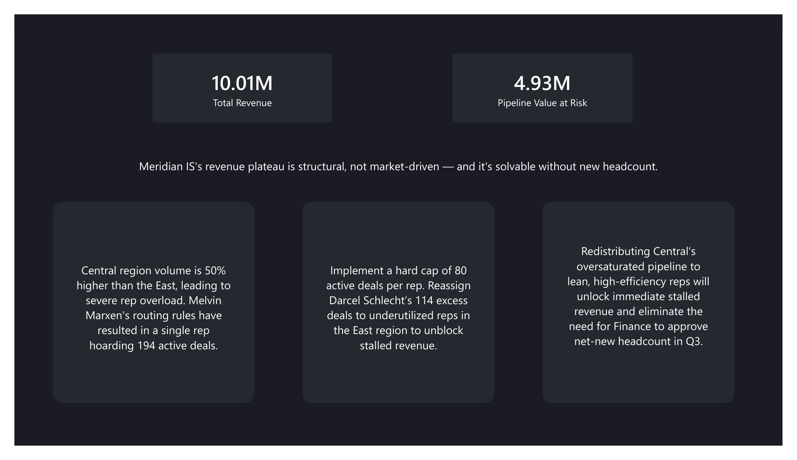

# Sales Force Capacity & Territory Analytics

**Project:** B2B Sales Operations Optimization (Meridian IS)  
**Tools Used:** Python (Pandas), SQL (SQLite), Power BI, DAX  

## The Business Scenario
Meridian Industrial Solutions (Meridian IS), a leading B2B distributor of heavy industrial equipment, parts, and commercial HVACR components, hit a sudden revenue plateau. The executive team was deadlocked on the cause and the solution:
* **The VP of Sales** suspected a market cooling and wanted to restructure territories.
* **The Director of Sales Ops** suspected territory imbalances were burning out top performers.
* **The Finance Director (FP&A)** refused to approve budget for new sales headcount, suspecting current reps were holding artificially inflated pipelines.

**The Goal:** Use data to prove which executive was right and provide a financially viable recommendation.

## Methodology
**Data Source:** Data sourced from Maven Analytics' CRM Sales Opportunities dataset (B2B sales pipeline data from a fictitious computer hardware company) and adapted to the Meridian IS scenario, including territory remapping, derived metrics (Revenue per Rep, Pipeline Value at Risk), and stakeholder framing to simulate enterprise sales operations conditions.

1. **Data Triage (Python/Pandas):** Ingested and cleaned raw CRM extracts (`sales_pipeline.csv`, `accounts.csv`, `teams.csv`). *See `audit_log.md` for the full data quality and imputation breakdown.*
2. **Exploratory Data Analysis (SQL):** Executed the SCAN framework to query territory volume vs. revenue efficiency. *See `audit_log.md` for the SQL insight logs.*
3. **Executive Dashboard (Power BI & DAX):** Built an interactive, 3-page reporting layer to visualize the bottlenecks and calculate the exact financial ROI of restructuring.

> **Analytical Note on Pipeline Value at Risk:** The raw dataset contained four stages: *Won, Lost, Engaging,* and *Prospecting*. Because there was no traditional "In Progress" designation, the "Pipeline Value at Risk" was calculated by isolating deals in the *Engaging* and *Prospecting* stages and multiplying them by the historical average value of a *Won* deal. 

---

## The Executive Dashboard

### 1. Territory Overview

*Proves that the Central Region's high deal volume is not translating to proportional revenue output.*

### 2. Representative Utilization

*Exposes the pipeline hoarding. Highlights severe burnout risk (194 active deals) and visually connects it back to management routing rules.*

### 3. Executive Recommendations & ROI

*Summarizes the financial impact, proving that restructuring the pipeline can unlock $4.93M in stalled value without requiring net-new headcount.*

---

## Strategic Recommendations & ROI

Meridian IS's revenue plateau is structural, not market-driven — and it's solvable without new headcount. By pulling the right operational levers, the business can unblock stalled deals and unlock an estimated **$4.93M** in pipeline value.

| Category | The Finding | The Business Lever | Recommendation |
| :--- | :--- | :--- | :--- |
| **Actionable** *(Short-Term)* | **Melvin Marxen is dumping 747 deals onto one rep.** | *High Control.* RevOps controls CRM lead-routing automation. | **Implement Lead Caps.** Institute a hard cap on active pipeline volume (e.g., 80 active deals per rep). Force managers to distribute leads evenly rather than relying solely on top performers. |
| **Actionable** *(Strategic)* | **Finance refuses to approve headcount.** Data shows current reps hoarding 100+ active deals. | *High Control.* Sales leadership dictates pipeline cleanup protocols. | **Enforce the "Close-Lost" Rule.** Require reps to immediately close-out stalled deals. Once the bloat is cleared, Finance will have an accurate utilization baseline to approve targeted hiring. |
| **Directional** | **Central region volume is 50% higher than the East.** | *Medium Control.* Highlights a broken territory mapping model. | **Redraw Territory Lines.** Shift lead routing criteria so that border-state inbound leads default to the underutilized East region rather than the flooded Central region. |